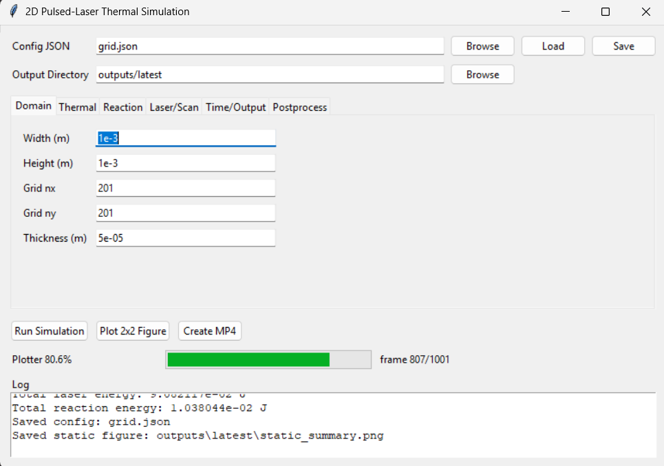

# Conversion boundary model for a photothermal exotherm with dynamic emissivity




2D pulsed-laser raster simulation over a reactive thin layer with:
- explicit finite-difference solver for temperature and conversion,
- Arrhenius reaction + exotherm coupling,
- Gaussian pulse deposition in space/time,
- raster path models (`offset_start`, `cross_hatch`),
- outputs, static plotting, ffmpeg MP4 animation, and GUI launcher.

Animation panels include:
- temperature field,
- conversion field (no scan path overlay),
- laser pulse power-density field (`W/m^2`),
- max-temperature + total-conversion line plot,
- cumulative laser-energy vs cumulative reaction-energy line plot.

## Install

```bash
python -m pip install numpy matplotlib
```

`ffmpeg` is required for MP4 animation.

## Run Simulation

```bash
python run_simulation.py --config default_config.json --output outputs/latest
```

## Static Plot (2x2)

```bash
python plot_results.py --output outputs/latest
```

## MP4 Animation (streamed to ffmpeg)

```bash
python animate_results.py --output outputs/latest --fps 20
```

## Stability Preflight

Use this before long runs to estimate explicit-solver stability limits and expected substepping:

```bash
python check_stability.py --config default_config.json
```

## GUI

```bash
python gui.py
```

## NaN Troubleshooting

- The solver is explicit in time. Smaller `width/height` at fixed `nx/ny` reduces `dx/dy`, which tightens the stable `dt` limit.
- If requested `dt` is too large, the solver now automatically uses internal substeps and reports:
  - `dt_internal_s`
  - `substeps_per_step`
  - `dt_cfl_limit_s`
  - `dt_recommended_s`
- Check `summary.txt` or run `check_stability.py` to anticipate runtime and stability before long jobs.

## To-do

- implement drastic increase in absorptivity for reacted regions

  - evaluate consequence of pulse overlap

  - evaluate consequence of scan path (e.g. `cross_hatch` vs `offset_start`)

- include unit change in the GUI

- status bar in GUI with steps remaining, max temp, etc.

- normalize conversion

- isothermal contours

- better GUI (browser?)

- cancel run from GUI

---

## Parameter considerations

### Asma thermodynamic estimates
*abridged; see email for slideshow and details*
Ea = 167 kJ/mol 
 - (40 kcal/mol)
 - for low-barrier dimerization-initiation of B10H14

dH = 3340 kJ/mol
 - (800 kcal/mol)
 - 3340 kJ/mol * 5.2 mol/kg = 1.7e7 J/kg
 - B10H8 forming large B clusters

---

*some insights from (2018) Li et al:* [here](<literature/(2018) Li et al - Synthesis and ceramic conversion of a new organodecaborane preceramic polymer with high ceramic yield.pdf>)

---

### process simplification
full thermo consideration seemingly would many processes:
1) dehydrogenation of B10H14 to B10H8
2) backbone scission
3) graphitization
4) dimerization of B10H8 to B20H16
5) cluster growth to large (100+) B clusters (**primary exotherm**)
6) B-C formation
7) pyrolysis (**mass loss -> heat loss**)
8) densification?

insofar as the backbone scission/pyrolysis can be simplified to **polyethylene**, [(2023) Mastalski et al](<literature/(2023) Mastalski et al - Intrinsic millisecond kinetics of polyethylene pyrolysis via pulse-heated analysis of solid reactions.pdf>) reports PE pyrolysis activation energy (Ea) and pre-exponential factor (A) as:

$Ea = 180 +/- 2.5 \space kJ \cdot mol^{-1}$  

 - will deviate depending on whether the transition state is stabilized or destabilized by the boron pendants/clusters

$A = 10^{11} \space s^{-1}$

- unimolecular bond-scission seems to appear around 2 orders of magnitude of here
- will go down if observed rate is transport-limited

(just starting to build rough estimates, I don't necessarily have a good reason to believe the kinetics are rate-limited here)

---

I can't find much good for the H2 evolution in the dehydrogenation step, but (2015) Barm et al. reported [here](<literature/(2015) Barm et al - A new homogeneous catalyst fo the dehydrogenation of dimethylamine borane starting with ruthenium(III) acetylacetonate.pdf>) on an amine-borane dehydrogenation catalyst with Ea = 85 kJ/mol
- solid mass transfer constraint probably prevents H2 diffusion and depresses effective pre-factor 


---

### misc. scratch calculations
density of the poly-decaborane monomer
B10H14 MW = 122 g/mol
C5H10 = 70 g/mol
total density = 192 g/mol
1000 g/kg / 192 g/mol = **5.2 mol/kg**


---

## notes (2026-02-21)

- lowered thickness to 6 um

- changed Ea and dH to reflect estimates

- estimated density, heat capacity, and thermal diffusivity from polymer materials (should ask Rob/Ben if there are better estimates from their papers)

- shot in the dark at Arrhenius = 1e3

- picked ambient loss of 10 W/m2K (partway between bounds for free convection), but probably bigger radiative losses at the expected temperatures

  - do radiative losses overwhelm convective losses before 1000K? it's probably worth modeling both at least between 500 K and 1000 K
  - what considerations are there for radiative losses from a bulk materials (scattering/reabsorption before it escapes?)

---

it's interesting note that "large initial conversion exotherm" and "drastic emissivity change in reacted material + pulse overlap" are similar "delayed impact" justifications that generate the necessary temperature rise to trigger the full reaction after the initial pulse(s) have deposited energy but before the reaction has fully run to completion